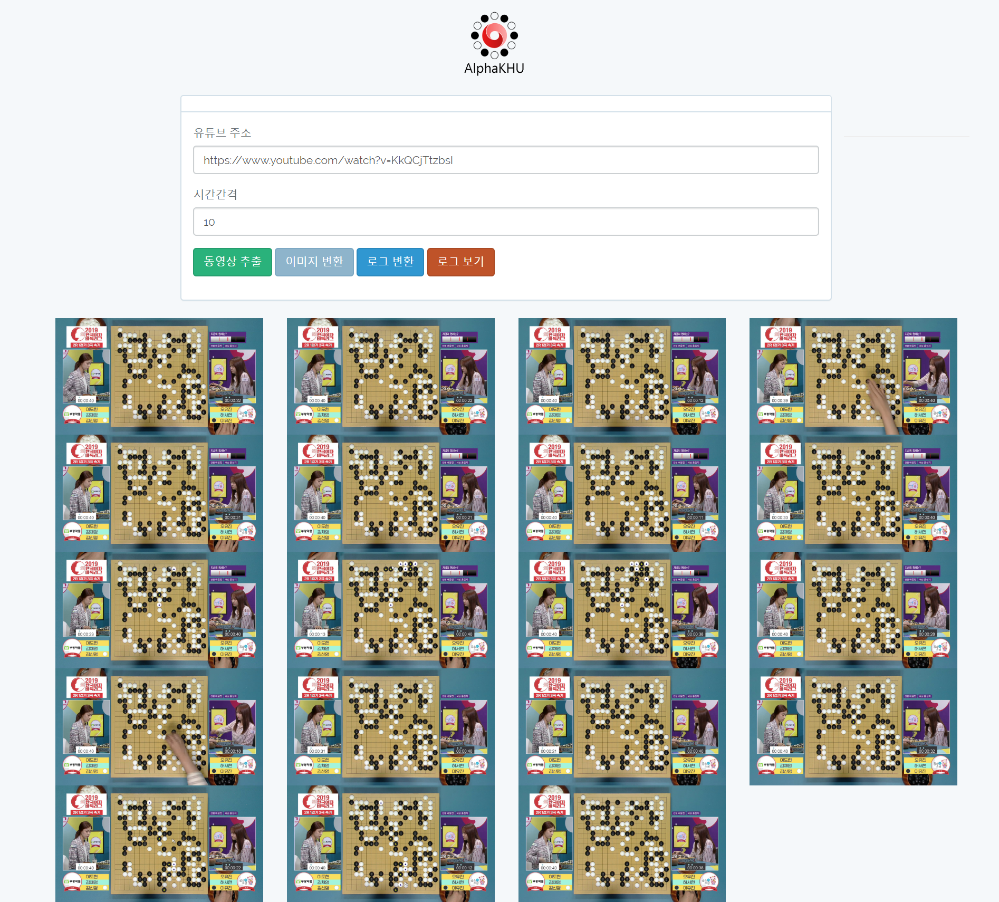

## AlphaKHU

<p align="center"> </p>

### 1. go_youtube

**Input**

- 유튜브 주소 : https://www.youtube.com/watch?v=KkQCjTtzbsI

- 시간간격 : 10

- `동영상 추출` 버튼 클릭

- `./static/frame` 폴더에 이미지가 저장됨

  


### 2. go_classificaiton

- `./static/frame` 폴더가 존재 시 `이미지 변환` 버튼 클릭
- `./static/processedframe` 폴더에 cropping된 이미지가 저장됨.


### 3. go_detection

- `./static/processedframe` 폴더가 존재 시 `로그 변환` 버튼 클릭
- `./static/logger`에 로그 파일이 저장됨.

[static/logger](static/logger)

```shell
. . . . . . . . . . . . . . . . . . .
. . . . . . . . . . . . . . B W . B W
. . . W B B . B B . . . B B B W W W .
. . . W W W . . W . B B W . W W B W .
. W W . . . . . . B W . W . . . B W .
. W B B . . . . . B W . W B W W B . .
. B B . . . . . . B B . W B B B B B .
. . W B . . . . W . . B B . . W W . .
. . . . . . . . . . . . . B B . . . .
. B B B . . . W . W . W B W . W . . .
. W B W B B . W B . . . W W . W W W .
. . W . W . . W . . . B . B . B W B .
. W . W . . W . B . . . . . B . B . .
. . W B W . . . . B . . . . W . B . .
. W . B B B B B . W B B . . . . B B .
. B B . . W B W W W B . . B B B W W .
. B W W W W W B W . B . W W B W . . W
. B W B W . B B W B . . . . W W W W .
. . B . B W . W . . . . . . . . . . .
```


### 4. go_front

- `./static/logger`에 파일이 존재시 웹 뷰어로 변환

### TODO


## Environment

- Ubuntu 16.04(for building `make`)
- python 2.7
- pillow>=3.0.0
- numpy==1.16.3
- flask>=1.0.2
- pytube>=9.5.0
- imutils==0.5.2
- virtualenv==16.6.0
- opencv-python==4.1.0.25


## Configuration

1. ```shell
   $ sudo apt-get update  
   ```

2. ```shell
   $ sudo apt-get install -y python git make gcc build-essential python-dev \
     python-pip libsm6 libxext6 libxrender-dev python-matplotlib
   ```

3. ```shell
   $ git clone https://github.com/AlphaKHU/AlphaKHU && cd AlphaKHU && make
   ```

4. ```shell
   $ pip install -r requirements.txt
   ```

5. ```shell
   $ python main.py
   ```
